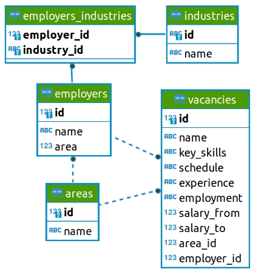
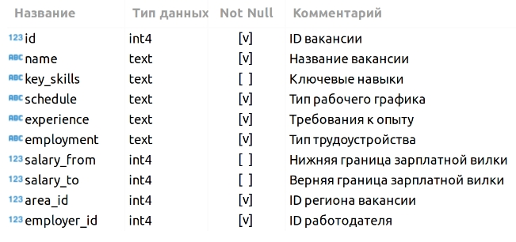

# <center> Преобразование, визуализация и очистка данных </center>
## Оглавление
1. [Описание проекта](#Описание-проекта)
2. [Описание данных](#Описание-данных)
3. [Зависимости](#Используемые-зависимости)
4. [Установка проекта](#Установка-проекта)
5. [Использование проекта](#Использование-проекта)
6. [Авторы](#Авторы)
7. [Выводы](#Выводы)

## Описание проекта

В проекте был проведен анализ вакансий из учебной базы данных, любезно предоставленной ресурсом HeadHunter. Анализ данных проводился с помощью SQL-запросов к удаленному серверу баз данных. Так же в проекте был оттаботан навык получения данных с интернет-сайтов разной направленности через HTML-интерфейс.  
Анализ вакансий был проведен в несколько этапов:
1. Предварительный анализ данных  
2. Детальный анализ вакансий
3. Анализ работодателей
4. Предметный анализ вакансий
5. Дополнительные исследования

## Описание данных
База данных представлена 5-ю связанным между собой таблиц. Схема базы данных и взаимосвязи таблиц предаставлена на рисунке ниже.



Назначение и содержание таблиц следующие:
Таблица VACANCIES (вакансии)  



Таблица_справочник AREAS (регионы)


Таблица EMPLOYERS (работодатели)


Таблица INDUSTRIES (сферы деятельности)


Tаблица EMPLOYERS_INDUSTRIES (работодатель-ыфера деятельности)


**Цель анализа данных** — получение знаний о части рынка труда, представленной работодателями.

**О структуре проекта:**
* [images](./images) - папка с изображениями, необходимыми для оформления проекта
* [JobAnalisis_HH.ipynb](./JobAnalisis_HH.ipynb) - jupyter-ноутбук, содержащий основной код проекта, в котором содержится анализ данных

## Используемые зависимости
* Python (3.7.6):
    * [numpy (1.21.6)](https://numpy.org)
    * [pandas (1.3.5)](https://pandas.pydata.org)
    * [plotly (5.18.0)](https://plotly.com)
    * [requests (2.31.0)]()
    * [urllib (2.0.7)]()

## Установка проекта

```
git clone https://github.com/vvnvrk/Job-analisis-on-HeadHunter.git
```

## Использование
Вся информация о работе представлена в jupyter-ноутбуке JobAnalisis_HH.ipynb. В файле представлены заданих по анализу данных и их выполнение.

## Авторы

* [Владимир Виноградов](https://ok.ru/profile/86044466081)

## Выводы

В результате проделанной работы были закреплены приемы по запросу данных из БД на языке SQL и их анализа. Были освоены медоты обработки табличных данных при помощи SQL_запросов к базе данных, а также приемы добычи данных из интернет-сайтов при помощи HTML-интерфейса.